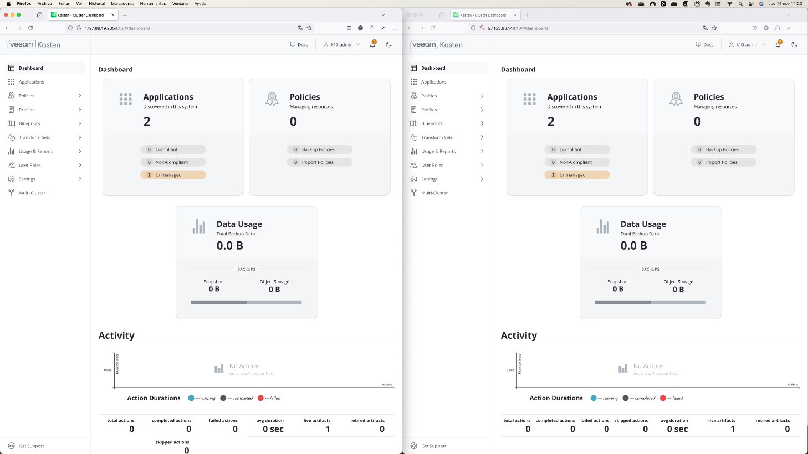
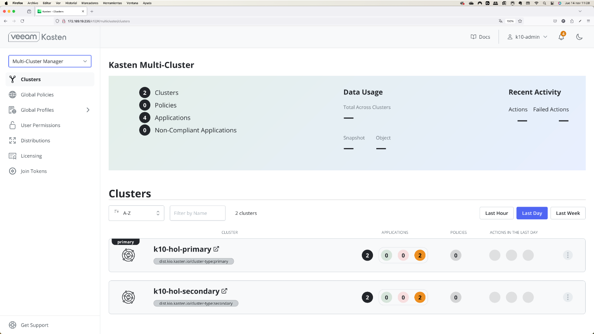

# Terraform-K10-Demos-GKE

***Status:** Work-in-progress. Please create issues or pull requests if you have ideas for improvement.*

# **Fully automated deploy of Google GKE Cluster with Kasten**
Example of using Terraform to automate the deploy of a Google GKE cluster, plus the installation and initial Kasten K10 configuration 


## Summary
This projects demostrates the process of deploying an Google GKE cluster, plus installing and configurig Kasten K10 using Terraform for fully automation of this process.  The resources to be created include:
* VPC Resources
* IAM Service Account with proper roles to install and use Kasten
* 2 GKE Cluster in different AZs (Potentially you could set it to run in different regions)
    - Volume Snapshot Class
    - StorageClass
* Google Cloud Storage Bucket
* Kasten in both GKE clusters
    - Basic Authentication
    - Access via LoadBalancer
    - EULA agreement
    - Location Profile creation using Google Cloud Storage Bucket
    - Policy preset samples creation
    - TransformSets
* 2 x Demo App2

An advanced optional configuration is included, which add the following features to Kasten configuration
* Multi-Cluster configuration
* Kanister Blueprints
* Blueprint Bindings

All the automation is done using Terraform and leveraging the Google Cloud, Kubernetes, and [Kasten K10](https://docs.kasten.io/latest/api/cli.html) APIs.

## Disclaimer
This project is an example of an deployment and meant to be used for testing and learning purposes only. Do not use in production. 


# Table of Contents

1. [Prerequisites](#Prerequisites)
2. [Installing GKE Cluster and Kasten](#Installing-GKE-Cluster-and-Kasten)
3. [Using the Google GKE cluster and Kasten](#Using-the-Google-GKE-cluster-and-Kasten)
4. [Destroying the GKE Cluster with Kasten](#Destroying-the-GKE-Cluster-with-Kasten)


## Prerequisites
To run this project you need to have some software installed and configured: 
1. [Terraform](https://developer.hashicorp.com/terraform/tutorials/Google Cloud-get-started/install-cli)
Ej. using brew for macOS

```
brew tap hashicorp/tap
brew install hashicorp/tap/terraform
```

2. [Kubectl](https://kubernetes.io/docs/tasks/tools/#kubectl)
Ej. using brew for macOS

```
brew install kubectl
```

3. [Install GCloud CLI](https://cloud.google.com/sdk/docs/install)
Ej. for macOS

```
curl "https://dl.google.com/dl/cloudsdk/channels/rapid/downloads/google-cloud-cli-480.0.0-darwin-x86_64.tar.gz" -o "gcloud.tar.gz"
tar -zxf gcloud.tar.gz
./google-cloud-sdk/install.sh
```

4. Configure GCloud CLI providing credentials with enough privileges to create resources in Google Cloud.
```
gcloud init
gcloud auth application-default login
gcloud components install gke-gcloud-auth-plugin
```

5. Download all terraform files and keep them locally, all in the same folder in your laptop.


## Installing GKE Cluster and Kasten
For Terraform to work, we need to provide certain information to be used as variables in the **terraform.tfvars** file.   

| Name                    | Type     | Default value       | Description                                                    |
| ----------------------- | -------- | ------------------- | -------------------------------------------------------------- |
| `region01`              | String   | `europe-west2`      | Google Cloud Region where all resources for Cluster01 will be created        |
| `az01`                  | list(string)   | `["europe-west2-a"]`| Google Cloud Availability Zone where all resources for Cluster01 will be created        |
| `region02`              | String   | `europe-west2`      | Google Cloud Region where all resources for Cluster01 will be created        |
| `az02`                  | list(string)   | `["europe-west2-b"]`| Google Cloud Availability Zone where all resources for Cluster01 will be created        |
| `project`               | String   | `gcp-project-name`  | Google Cloud Project name                            |
| `cluster_name01`        | String   | `k10cluster1`               | Name of the cluster to be created.  All Google Cloud resources will use the same name  |
| `cluster_name02`        | String   | `k10cluster2`               | Name of the cluster to be created.  All Google Cloud resources will use the same name  |
| `gke_num_nodes`         | Number   | `3`                 | Number of GKE Worker nodes to be created  |
| `machine_type`          | String   | `e2-standard-2`     | Machine type for GKE Worker nodes  |
| `subnet_cidr_block_ipv4`| String   | `10.50.0.0/16`      | CIDR for VPC Subnet to be created  |
| `owner`                 | String   | `patricio_cerda`    | Owner tag in Google Cloud            |
| `activity`              | String   | `demo`              | Activity tag in Google Cloud         |
| `admin_password`        | String   | `Veeam123!`              | Password for Kasten admin user          |


### Building the GKE Cluster with Kasten
Once the variables are set, the only thing we need to do is to apply the Terraform files:
- By using a terminal, go to the folder containing all terraform files adn folders.
- Run the following commands
```
terraform -chdir=basic init
terraform -chdir=basic apply
```

## Using the Google GKE cluster and Kasten
Once Terraform is done building the infrastructure and installing Kasten, you will get the following information:

| Name                    | Value       | Description                                                    |
| ----------------------- | ----------- | -------------------------------------------------------------- |
| `gke_cluster_name_01  `        | `gke-k10-1719243246`         | Name of the Google GKE cluster created, with a random number to prevent conflicts               |
| `gke_cluster_name_02  `        | `gke-k10-1719243246`         | Name of the Google GKE cluster created, with a random number to prevent conflicts               |
| `app_k10app_url`           | `http://34.142.124.14`              | URL to access the demo Stock app        |
| `app_pacman_url`           | `http://34.142.124.15`              | URL to access the demo Pacman app        |
| `k10_password `               | `Veeam123!/`    | URL to access the Kasten K10 Dashboard  |
| `k10_username `               | `admin`    | URL to access the Kasten K10 Dashboard  |
| `k10url_gke01 `               | `http://34.147.149.221/k10/`    | URL to access the Kasten K10 Dashboard  |
| `k10url_gke02 `               | `http://34.147.149.222/k10/`    | URL to access the Kasten K10 Dashboard  |
| `kubeconfig_gke01`            | `gcloud container clusters get-credentials gke-k10-1719243246 --region europe-west2-a` | Command to configure the kubeconfig file and access the kubernetes cluster with kubectl  |
| `kubeconfig_gke02`            | `gcloud container clusters get-credentials gke-k10-1719243247 --region europe-west2-b` | Command to configure the kubeconfig file and access the kubernetes cluster with kubectl  |

At this point, it's possible to run tests to backup and restore the demo App, creating policies.

	

## Destroying the GKE Cluster with Kasten
Once you are done using the GKE cluster, you can destroy it alonside all other resources created with Terraform, by using the following command:
```
terraform -chdir=basic destroy
```

### Advanced Kasten configuration
The only thing we need to do is to apply the Terraform files:
- By using a terminal, go to the folder containing all terraform files and folders.
- Run the following commands
```
terraform -chdir=advanced init
terraform -chdir=advanced apply
```
## Using the Google GKE cluster and Kasten
Once Terraform is done configuring additional Kasten features, you will get the following information:

| Name                    | Value       | Description                                                    |
| ----------------------- | ----------- | -------------------------------------------------------------- |
| `gcs_bucket_global_name  `        | `gcs-hol-global-1735914253`         | Name of the Google Cloud Storage Bucket to be used as Global Location Profile               |
| `gcs_bucket_global_projectid  `   | `gcp-project-name`  | Google Cloud Project name 
| `gcs_bucket_global_region`        | `europe-west2`              | Region for the Google Cloud Storage Bucket        |
| `gcs_bucket_global_service_key`   | `Service Key`              | Service Key for the Google Cloud Storage Bucket        |


Now it's also possible to use Kanister for consistent backups of the PostgreSQL database, and also demo the Multi-Cluster feature with Global Location Profiles and Global Policies.

	